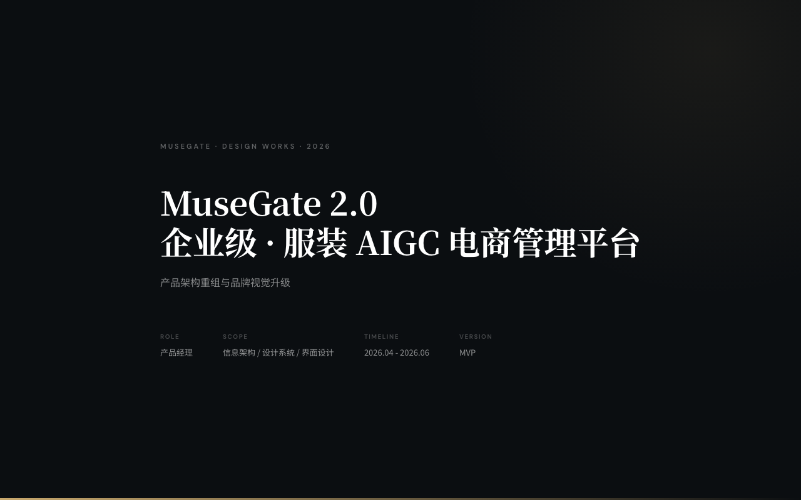
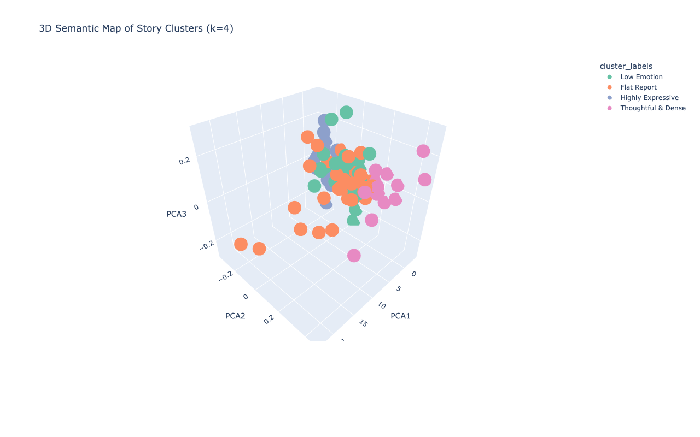

# Hi, I'm Zhang Chen 👋

**English** · [中文](README.zh-CN.md)

## ⭐ Featured projects

The work I want to show from my CV — both are interactive. **Click the image to open the live demo.**

### MuseGate · Enterprise AIGC commerce platform for fashion

> **Product Lead · 2026.04–2026.06 · [▶ Open live portfolio](https://chen-zhang816.github.io/musegate-portfolio/)**

A ToB AIGC content-production tool for fashion e-commerce merchants, lifting both asset throughput and aesthetic quality. I owned the product end-to-end: re-architected the platform from *tool-driven* to *SKU-driven*, designed a multi-model routing strategy (Nano Banana / GPT-image / aesthetic models), built the prompt systems, and rebuilt the visual identity into a calm, confident dark theme. The linked page is the full design portfolio — information architecture, user journeys, and the 2.0 redesign.

###  Echo Story · Semantic search over patient narratives

> **MDS dissertation · 2025.03–2025.9 · [▶ Open interactive map](https://chen-zhang816.github.io/semantic-map/) (https://github.com/chen-Zhang816/semantic-map)**

A semantic retrieval system for digital health storytelling. I designed a two-layer semantic annotation scheme over **80k words of real patient narratives**, ran structured labeling and style clustering, and shipped an **interactive 3D semantic map** (live above) plus a topic-similarity network.

---

##  How I work

**Problem-first**: start from real user pain and evidence, then decide what (not) to build.

**Build to think**: prototype with coding agents to pressure-test ideas before committing a team's time.

**Data + narrative**: pair quantitative signals with the human story behind them.

**Quality as a system**: eval sets, labeling standards, and RAG / SFT / RL, not vibes.

---

Thanks for stopping by — feel free to reach out at chen972022@163.com.
